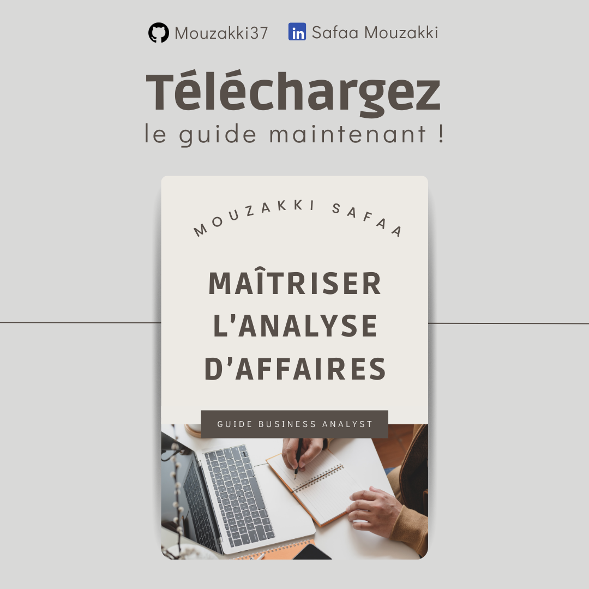

𝐆𝐮𝐢𝐝𝐞 𝐝𝐮 𝐁𝐮𝐬𝐢𝐧𝐞𝐬𝐬 𝐀𝐧𝐚𝐥𝐲𝐬𝐭 - 𝐌𝐨𝐧 𝐏𝐚𝐫𝐜𝐨𝐮𝐫𝐬 𝐝'𝐀𝐮𝐭𝐨-𝐅𝐨𝐫𝐦𝐚𝐭𝐢𝐨𝐧 📚

𝐀̀ 𝐩𝐫𝐨𝐩𝐨𝐬 𝐝𝐞 𝐜𝐞 𝐠𝐮𝐢𝐝𝐞 🎯
Ce guide est le fruit de mon parcours d'auto-formation au métier de Business Analyst. Il rassemble mes apprentissages, recherches et synthèses basés sur :

-L'étude approfondie du BABOK® Guide (Business Analysis Body of Knowledge)
-Des recherches extensives sur Internet et la littérature professionnelle
-L'analyse des meilleures pratiques du secteur
-La synthèse de différentes ressources en ligne

𝐎𝐛𝐣𝐞𝐜𝐭𝐢𝐟 🚀
L'objectif de ce guide est double :
    -Documenter mon parcours d'apprentissage du métier de Business Analyst
    -Partager ces connaissances avec d'autres personnes intéressées par ce domaine

📝 𝐓𝐚𝐛𝐥𝐞 𝐝𝐞𝐬 𝐌𝐚𝐭𝐢𝐞̀𝐫𝐞𝐬 :
1. Introduction à l'Analyse d'Affaires
2. Planification de l'Analyse d'Affaires
3. Elicitation et Collaboration
4. Gestion du Cycle de Vie des Exigences
5. Analyse Stratégique
6. Analyse des Exigences et Définition de la Conception
7. Évaluation des Solutions
8. Amélioration des Processus
9. Outils et Technologies en Analyse d'Affaires
10. Éthique Professionnelle en Analyse d'Affaires
11. Sujets Avancés en Analyse d'Affaires
12. Développement de Carrière en Analyse d'Affaires
    
📖 𝐀𝐩𝐞𝐫𝐜̧𝐮 𝐝𝐮 𝐏𝐫𝐨𝐣𝐞𝐭 :
    Cette documentation est conçue pour explorer tous les aspects essentiels de l'analyse d'affaires, incluant les techniques de collecte et de gestion des exigences, la collaboration avec les parties prenantes, et les outils d'analyse de données. Elle est conçue pour être utilisée à la fois comme guide d'apprentissage et comme référence pratique pour les Business Analysts de tous niveaux.

Chaque section est composée de guides détaillés, d'exemples concrets, et de diagrammes pour illustrer les concepts.

  
📝 𝐂𝐨𝐧𝐭𝐞𝐧𝐮 𝐝𝐮 𝐏𝐫𝐨𝐣𝐞𝐭
1. Introduction à l'Analyse d'Affaires
     - Définition et rôle d’un Business Analyst
     - Concepts clés : besoins métier, solutions, impact de l'analyse d'affaires
2. Planification de l'Analyse d'Affaires
     - Planification de l'approche, identification des parties prenantes, et gouvernance
     - Gestion des informations et planification des activités
3. Elicitation et Collaboration
     - Techniques d’élicitation (interviews, ateliers)
     - Communication avec les parties prenantes
4. Gestion du Cycle de Vie des Exigences
     - Traçabilité, priorisation, gestion des changements
5. Analyse Stratégique
     - Analyse de l’état actuel et futur, évaluation des risques
6. Analyse des Exigences et Définition de la Conception
     - Modélisation, vérification, et validation des exigences
7. Évaluation des Solutions
     - Mesures de performance, analyse des résultats, recommandations d'amélioration
8. Amélioration des Processus
     - Identification des opportunités, modélisation des processus
9. Outils et Technologies en Analyse d'Affaires
     - Utilisation d'Excel, SQL, Tableau, PowerBI, Visio, JIRA et Confluence
10. Éthique Professionnelle en Analyse d'Affaires
     - Code de conduite IIBA, considérations éthiques
11. Sujets Avancés en Analyse d'Affaires
     - Analyse agile, BI et analyse de données, gestion de projet
12. Développement de Carrière en Analyse d'Affaires
     - Certifications, réseau professionnel, développement continu

𝐒𝐨𝐮𝐫𝐜𝐞𝐬 𝐞𝐭 𝐑𝐞́𝐟𝐞́𝐫𝐞𝐧𝐜𝐞𝐬 📖
Ce guide s'appuie sur plusieurs sources de référence :

-BABOK® Guide v3
-Articles professionnels
-Blogs spécialisés
-Retours d'expérience de Business Analysts

𝐂𝐨𝐧𝐭𝐫𝐢𝐛𝐮𝐭𝐢𝐨𝐧 🤝
Ce guide est en constante évolution. Vos contributions sont les bienvenues :
-Suggestions d'amélioration
-Corrections
-Partage d'expérience
-Nouvelles ressources

𝐄́𝐭𝐚𝐭 𝐝𝐮 𝐏𝐫𝐨𝐣𝐞𝐭 📈
🟢 En cours de développement actif
Je mets régulièrement à jour ce guide avec de nouvelles informations et ressources au fur et à mesure de mon apprentissage.

𝐀𝐯𝐞𝐫𝐭𝐢𝐬𝐬𝐞𝐦𝐞𝐧𝐭 ⚠️
Ce guide reflète mon parcours personnel d'apprentissage. Bien que je m'efforce d'être aussi précis que possible, il peut contenir des inexactitudes. N'hésitez pas à me contacter pour toute correction ou suggestion d'amélioration.

𝐂𝐨𝐧𝐭𝐚𝐜𝐭 📫
N'hésitez pas à me contacter sur LinkedIn : Safaa Mouzakki
GitHub : Mouzakki37

𝐋𝐢𝐜𝐞𝐧𝐜𝐞 📜
Ce projet est sous licence MIT - voir le fichier LICENSE pour plus de détails.

𝐑𝐞𝐦𝐞𝐫𝐜𝐢𝐞𝐦𝐞𝐧𝐭𝐬 🙏
Je tiens à remercier la communauté des Business Analysts qui partage généreusement leurs connaissances en ligne, ainsi que tous ceux qui contribuent à enrichir ce guide.

Dernière mise à jour : 25/11/2024
